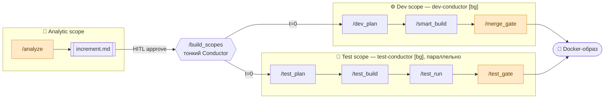

# ms-platform

> **Multiagent System Platform** — конфигурация [Claude Code](https://claude.com/claude-code), которая силами специализированных ИИ-агентов прогоняет сквозной цикл **Analytic → Dev → Test** с человеческими gate'ами в ключевых точках.

<p align="left">
  
  
  
  
</p>

---

## Что это

`ms-platform` — это **не приложение и не CLI**, а наполнение для Claude Code как runtime: набор `agents/`, `commands/`, `hooks/`, `refs/` и MCP-конфигов, который превращает свободно сформулированную задачу заказчика в готовый инкремент микросервиса — с аналитикой, кодом, автотестами и проверками на каждом шаге.

> **Подход:** Claude Code как backend. Вся работа агентов — через стандартные примитивы (commands, agents, hooks, MCP, refs). Никакого собственного приложения / CLI / LLM-gateway.

**Целевые проекты:** greenfield-инкременты микросервисов на **Java + Spring Boot 3.x**. Стек агентов мультиязычный из коробки (Java / React / TypeScript / Python / Rust в refs), фокус команды — Java/Spring.

**Итоговый артефакт цикла** — Docker-образ продукта, пригодный к ручному деплою на тестовый стенд.

---

## Пайплайн



В ключевых точках — **HITL-gate** (Human-In-The-Loop): заказчик подтверждает результат прямо в сессии Claude Code, прежде чем процесс пойдёт дальше. На fail-валидации или ревью соответствующий агент правит сам, не дёргая заказчика без нужды.

**`/build_scopes`** — параллельный вход: из `increment.md` он одновременно (t=0) запускает два фоновых conductor'а — `dev-conductor` (Dev) и `test-conductor` (Test), которые независимы и читают один `increment.md`. Conductor'ы не умеют `AskUserQuestion` — их вопросы «всплывают» в главный тред, который спрашивает заказчика и возобновляет conductor через `SendMessage`. Расхождения Dev/Test разрешаются на `/test_run`. Standalone-команды (`/dev_plan`, `/smart_build`, `/test_plan`, `/test_build`) сохраняются для ручного прогона одного scope.

### Три scope-а

| Scope | Команды | Что делает | Артефакты |
|---|---|---|---|
| **Analytic** | `/analyze` | Интервью с заказчиком → спецификация инкремента (ФТ/НФТ, business-flow, сценарии, acceptance criteria), валидация + семантическое ревью, HITL-approve. | `analytic/original_task.txt`, `analytic/increment.md`, `analytic/review-report.json` |
| **Dev** | `/dev_plan` → `/smart_build` → `/merge_gate` | План с командой → сборка кода с роутингом контекста и юнит-тестами → финальный merge-gate. | `specs/<план>.md`, код инкремента |
| **Test** *(параллельно с Dev)* | `/test_plan` → `/test_build` → `/test_run` → `/test_gate` | Модель тестов + план по слоям → авторинг автотестов → прогон и триаж падений → финальный gate. | `test/test-model.md`, `test/test-plan.md`, автотесты, `test/bugs/` |

---

## Команды

| Команда | Scope | Назначение |
|---|---|---|
| `/analyze` | Analytic | Старт: интервью с заказчиком, запись `increment.md`, валидация + ревью, HITL-approve. |
| `/build_scopes` | Dev + Test | Параллельный вход: из `increment.md` одновременно запускает `dev-conductor` и `test-conductor` в фоне, релеит их вопросы заказчику. Тонкий оркестратор — сам не планирует/не собирает/git не трогает. |
| `/dev_plan` | Dev | Инженерный план реализации в `specs/` (с Test Infra interview и ревью плана). |
| `/smart_build` | Dev | Сборка кода с семантическим роутингом контекста (грузит только нужные секции). |
| `/merge_gate` | Dev | Финальный HITL merge-gate: diff + вердикты → commit инкремента и (по подтверждению) merge. |
| `/test_plan` | Test | Из `increment.md` — `test-model.md` и `test-plan.md` с задачами по слоям. |
| `/test_build` | Test | Авторинг автотестов: autotester-агенты по слоям + code-review. |
| `/test_run` | Test | Прогон сьюта, классификация падений (test-side / service-side), фиксы и баг-репорты. |
| `/test_gate` | Test | Финальный HITL gate Test scope: тест-дифф + результат прогона + баги. |

---

## Агенты

Роли исполнителей живут в `.claude/agents/` и сгруппированы по scope-ам.

| Scope | Агенты |
|---|---|
| **analytic** | `business-analyst` — пишет `increment.md`; `analytic-reviewer` — семантическое ревью против исходной задачи. |
| **dev** | `dev-conductor` — фоновый дирижёр Dev-пайплайна (план + сборка); `developer` — продуктовый код; `unit-tester` — юнит-тесты. |
| **test** | `test-conductor` — фоновый дирижёр Test-авторинга; `test-analyst` — модель тестов; `test-explorer` — тест-ландшафт; `autotester` — автотесты высоких слоёв; `failure-analyzer` — триаж падений; `bug-reporter` — баг-репорты. |
| **shared** | `explorer`, `context-router`, `plan-reviewer`, `code-reviewer`, `validator` — переиспользуются между scope-ами. |
| **meta** | `meta-agent` — генерирует новые агенты по описанию. |

---

## Структура репозитория

```
.claude/            # ядро — Claude Code конфигурация
  ├── agents/       # роли исполнителей, по scope-ам (analytic/ dev/ test/ shared/)
  ├── commands/     # slash-команды (/analyze, /dev_plan, /test_run, …)
  ├── hooks/        # lifecycle-хуки + валидаторы (Python)
  ├── refs/         # доменные референсы (java-patterns, java-testing, …)
  ├── config/       # шаблоны (increment_template.yaml)
  └── settings.json
docs/               # документация компонентов (context-routing, validators, …)
specs/              # планы и research-материалы
install.sh          # установка конфигурации + регистрация MCP-серверов
uninstall.sh        # удаление
ruff.toml / ty.toml # линтер и type-checker для хуков
```

---

## Требования к окружению

- **Claude Code CLI** (`claude`) — основной runtime.
- **uv** — менеджер Python, нужен для запуска хуков, валидаторов и MCP-сервера `serena` (через `uvx`).
- **Node.js** (`npm` / `npx`) — нужен для MCP-сервера `context7` и (опционально) для CLI `openspec`.
- **Git** — артефакты живут в ветках инкрементов.

---

## Установка

```bash
./install.sh
```

Скрипт регистрирует хуки в локальной директории `.claude/` относительно проекта, на котором будет работать Claude Code, пытается зарегистрировать MCP-серверы и поставить/инициализировать OpenSpec (см. ниже). Для `context7` после установки нужно вручную подставить API-ключ.

---

## MCP-серверы

Агенты используют два MCP-сервера, и **их нужно подключить отдельно** — без них часть инструментов агентов работать не будет:

- **`context7`** — актуальная документация библиотек и фреймворков (используется developer / autotester / reviewer-агентами).
- **`serena`** — семантический тулкит по коду (поиск символов, ссылок, обзор структуры).

`install.sh` регистрирует оба сервера автоматически, если в системе есть `claude`, `npx` и `uvx`. Проверить, что серверы подключены:

```bash
claude mcp list
```

### Генерация API-ключа для context7 (обязательно)

Без API-ключа `context7` работает на жёстком общем rate-limit и быстро упирается в лимиты при работе команды агентов. **Ключ нужно сгенерировать и подставить:**

1. Зарегистрируйтесь на [context7.com](https://context7.com) и войдите в аккаунт.
2. Откройте **Dashboard → API Keys** и создайте новый ключ (формат `ctx7sk-...`).
3. Скопируйте ключ и подключите сервер с ним (перерегистрация поверх существующего):

```bash
# удалить ранее добавленный сервер без ключа (если был)
claude mcp remove context7

# добавить заново, передав ключ
claude mcp add context7 -- npx -y @upstash/context7-mcp@latest --api-key YOUR_CONTEXT7_API_KEY
```

> ⚠️ Храните ключ как секрет — не коммитьте его в репозиторий. `.mcp.json` с ключом в Git попадать не должен.

### Подключение serena (API-ключ не нужен)

```bash
claude mcp add serena -- uvx --from git+https://github.com/oraios/serena \
  serena start-mcp-server --context ide-assistant --project "$(pwd)"
```

После подключения перезапустите сессию Claude Code, чтобы серверы поднялись.

---

## OpenSpec (опционально — living specs)

[OpenSpec](https://www.npmjs.com/package/@fission-ai/openspec) — это **CLI-инструмент** (не MCP-сервер), который ведёт «живые» спецификации и дельта-изменения. Он встроен в пайплайн в трёх точках и активируется, только если установлен и инициализирован в проекте — иначе соответствующие шаги **молча пропускаются**, и основной цикл работает без него.

| Точка интеграции | Команда | Что делает |
|---|---|---|
| **Explore** | `/dev_plan` (Step 2) | Читает существующие спеки (`openspec list/show`) и подмешивает их в вопросы интервью — ищет конфликты с текущими требованиями. |
| **Propose** | `/dev_plan` (Step 13) | После прохождения ревью плана создаёт `openspec/changes/<name>/` (proposal.md, specs/, design.md, tasks.md). |
| **Track** | `/smart_build` (Step 4) | По ходу сборки отмечает выполненные задачи `[x]` в `tasks.md` (видно через `openspec view`). |

> Интеграция оркеструется **командами**, а не промптами суб-агентов. После сборки доступны собственные команды OpenSpec — `/opsx:verify` и `/opsx:archive`.

### Установка и инициализация

`install.sh` ставит и инициализирует OpenSpec автоматически, если в системе есть `npm`. Вручную:

```bash
npm i -g @fission-ai/openspec      # глобальная установка CLI
openspec init --tools claude       # в корне проекта — создаёт openspec/ + команды /opsx:*
```

Проверить, что инициализация прошла:

```bash
openspec list           # активные changes
openspec list --specs   # существующие спеки
```

После `openspec init` перезапустите сессию Claude Code, чтобы команды `/opsx:*` подхватились.

---

## Использование

Запуск всего цикла начинается с Analytic scope. Из корня целевого микросервиса (где установлен `.claude/`):

```bash
claude "/analyze <краткая формулировка задачи от заказчика, одна-две фразы>"
```

> `/analyze` ведёт интерактивное интервью, поэтому запускайте его в **интерактивной сессии** (не в headless `-p`).

После approve инкремента самый простой путь — `/build_scopes`: он запускает Dev и Test параллельно из одного `increment.md`. Отдельные команды можно вызывать и вручную (по одному scope):

```text
/build_scopes  # параллельный запуск Dev + Test из increment.md
/dev_plan      # планирование с командой (только Dev)
/smart_build   # сборка с роутингом контекста
/test_plan     # план автотестов по слоям (только Test)
```

---

## Состояние разработки

Идёт построение MVP. Базовая Claude Code-конфигурация подтянута из апстрима [`a-simeshin/claude-code-hooks-mastery`](https://github.com/a-simeshin/claude-code-hooks-mastery) (форк disler). Дальнейшая работа — расширение `.claude/` под наши Analytic / Test scope-ы.

---

## Дизайн-документы

- [`ARCHITECTURE_PROPOSAL.md`](./ARCHITECTURE_PROPOSAL.md) — архитектура целиком (v2 от 2026-06-11).
- [`AGENTS_SPECIFICATION.md`](./AGENTS_SPECIFICATION.md) — каталог агентов, команд и хуков; черновые промпты новых агентов.
- [`IMPLEMENTATION_ROADMAP.md`](./IMPLEMENTATION_ROADMAP.md) — план MVP-0 на 2 недели.
- [`PIVOT.md`](./PIVOT.md) — журнал решения о pivot'е на Claude Code backend.

---

## Лицензия

[Apache License 2.0](./LICENSE) для всего, что добавлено в этом проекте.
Содержимое `.claude/`, `docs/`, `specs/`, `install.sh`, `uninstall.sh`, `ruff.toml`, `ty.toml` — перенесено из апстрима; см. оригинальный [`UPSTREAM-README.md`](./UPSTREAM-README.md).
