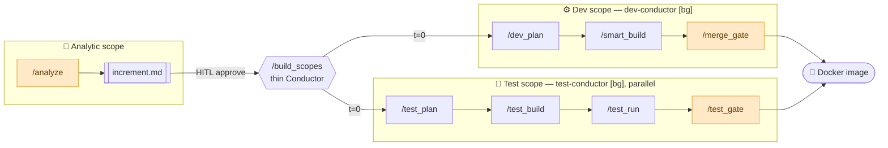

# ms-platform

> **Multiagent System Platform** — a [Claude Code](https://claude.com/claude-code) configuration that runs an end-to-end **Analytic → Dev → Test** pipeline using specialized AI agents, with human gates at key checkpoints.

<p align="left">
  
  
  
  
</p>

---

## What it is

`ms-platform` is **not an application or a CLI**, but a Claude Code runtime configuration: a set of `agents/`, `commands/`, `hooks/`, `refs/`, and MCP configs that turns a freely formulated customer task into a finished microservice increment — with analytics, code, automated tests, and checks at every step.

> **Approach:** Claude Code as the backend. All agent work is done through standard primitives (commands, agents, hooks, MCP, refs). No custom application / CLI / LLM-gateway.

**Target projects:** greenfield microservice increments on **Java + Spring Boot 3.x**. The agent stack is multi-language out of the box (Java / React / TypeScript / Python / Rust in refs); the team focus is Java/Spring.

**The cycle's final artifact** — a Docker image of the product, ready for manual deployment to a test stand.

---

## Pipeline



At key checkpoints — **HITL-gate** (Human-In-The-Loop): the customer confirms the result directly in the Claude Code session before the process continues. On validation failure or review, the relevant agent self-corrects without bothering the customer unnecessarily.

**`/build_scopes`** — the parallel entry point: from `increment.md` it simultaneously (t=0) launches two background conductors — `dev-conductor` (Dev) and `test-conductor` (Test), which are independent and both read the same `increment.md`. Conductors cannot call `AskUserQuestion` — their questions "bubble up" to the main thread, which asks the customer and resumes the conductor via `SendMessage`. Dev/Test divergences are resolved at `/test_run`. Standalone commands (`/dev_plan`, `/smart_build`, `/test_plan`, `/test_build`) are preserved for running a single scope manually.

### Three scopes

| Scope | Commands | What it does | Artifacts |
|---|---|---|---|
| **Analytic** | `/analyze` | Customer interview → increment specification (FR/NFR, business-flow, scenarios, acceptance criteria), validation + semantic review, HITL approve. | `analytic/original_task.txt`, `analytic/increment.md`, `analytic/review-report.json` |
| **Dev** | `/dev_plan` → `/smart_build` → `/merge_gate` | Plan with team → code build with context routing and unit tests → final merge-gate. | `specs/<plan>.md`, increment code |
| **Test** *(parallel with Dev)* | `/test_plan` → `/test_build` → `/test_run` → `/test_gate` | Test model + plan per layer → autotest authoring → run and failure triage → final gate. | `test/test-model.md`, `test/test-plan.md`, autotests, `test/bugs/` |

---

## Commands

| Command | Scope | Purpose |
|---|---|---|
| `/analyze` | Analytic | Start: customer interview, write `increment.md`, validation + review, HITL approve. |
| `/build_scopes` | Dev + Test | Parallel entry: from `increment.md` simultaneously launches `dev-conductor` and `test-conductor` in background, relays their questions to the customer. Thin orchestrator — does not plan/build/touch git itself. |
| `/dev_plan` | Dev | Engineering implementation plan in `specs/` (with Test Infra interview and plan review). |
| `/smart_build` | Dev | Code build with semantic context routing (loads only the needed sections). |
| `/merge_gate` | Dev | Final HITL merge-gate: diff + verdicts → commit the increment and (on confirmation) merge. |
| `/test_plan` | Test | From `increment.md` — `test-model.md` and `test-plan.md` with tasks per layer. |
| `/test_build` | Test | Autotest authoring: autotester agents per layer + code review. |
| `/test_run` | Test | Run the suite, classify failures (test-side / service-side), fixes and bug reports. |
| `/test_gate` | Test | Final HITL gate for Test scope: test diff + run result + bugs. |

---

## Agents

Roles live in `.claude/agents/` and are grouped by scope.

| Scope | Agents |
|---|---|
| **analytic** | `business-analyst` — writes `increment.md`; `analytic-reviewer` — semantic review against the original task. |
| **dev** | `dev-conductor` — background conductor for the Dev pipeline (plan + build); `developer` — product code; `unit-tester` — unit tests. |
| **test** | `test-conductor` — background conductor for Test authoring; `test-analyst` — test model; `test-explorer` — test landscape; `autotester` — higher-layer autotests; `failure-analyzer` — failure triage; `bug-reporter` — bug reports. |
| **shared** | `explorer`, `context-router`, `plan-reviewer`, `code-reviewer`, `validator` — reused across scopes. |
| **meta** | `meta-agent` — generates new agents from a description. |

---

## Repository Structure

```
.claude/            # core — Claude Code configuration
  ├── agents/       # agent roles, grouped by scope (analytic/ dev/ test/ shared/)
  ├── commands/     # slash commands (/analyze, /dev_plan, /test_run, …)
  ├── hooks/        # lifecycle hooks + validators (Python)
  ├── refs/         # domain references (java-patterns, java-testing, …)
  ├── config/       # templates (increment_template.yaml)
  └── settings.json
docs/               # component documentation (context-routing, validators, …)
specs/              # plans and research materials
install.sh          # install config + register MCP servers
uninstall.sh        # uninstall
ruff.toml / ty.toml # linter and type-checker for hooks
```

---

## Environment Requirements

- **Claude Code CLI** (`claude`) — the primary runtime.
- **uv** — Python package manager, needed to run hooks, validators, and the `serena` MCP server (via `uvx`).
- **Node.js** (`npm` / `npx`) — needed for the `context7` MCP server and (optionally) the `openspec` CLI.
- **Git** — artifacts live on increment branches.

---

## Installation

```bash
./install.sh
```

The script registers hooks in the local `.claude/` directory relative to the project where Claude Code will run, attempts to register MCP servers, and installs/initializes OpenSpec (see below). For `context7`, you need to manually add the API key after installation.

---

## MCP Servers

Agents use two MCP servers, and **they must be connected separately** — without them, some agent tools will not work:

- **`context7`** — up-to-date library and framework documentation (used by developer / autotester / reviewer agents).
- **`serena`** — semantic code toolkit (symbol search, references, structure overview).

`install.sh` registers both servers automatically if `claude`, `npx`, and `uvx` are present on the system. Verify that the servers are connected:

```bash
claude mcp list
```

### Generate an API key for context7 (required)

Without an API key, `context7` runs on a hard shared rate limit and quickly hits limits when an agent team is working. **You need to generate and set a key:**

1. Register at [context7.com](https://context7.com) and log in.
2. Open **Dashboard → API Keys** and create a new key (format `ctx7sk-...`).
3. Copy the key and connect the server with it (re-register over the existing one):

```bash
# remove the previously added server without a key (if any)
claude mcp remove context7

# add it again, passing the key
claude mcp add context7 -- npx -y @upstash/context7-mcp@latest --api-key YOUR_CONTEXT7_API_KEY
```

> ⚠️ Keep the key as a secret — do not commit it to the repository. `.mcp.json` with a key must not go into Git.

### Connect serena (no API key needed)

```bash
claude mcp add serena -- uvx --from git+https://github.com/oraios/serena \
  serena start-mcp-server --context ide-assistant --project "$(pwd)"
```

After connecting, restart the Claude Code session so the servers come up.

---

## OpenSpec (optional — living specs)

[OpenSpec](https://www.npmjs.com/package/@fission-ai/openspec) is a **CLI tool** (not an MCP server) that maintains "living" specifications and delta changes. It is embedded in the pipeline at three points and activates only if installed and initialized in the project — otherwise the relevant steps **silently skip** and the main cycle works without it.

| Integration point | Command | What it does |
|---|---|---|
| **Explore** | `/dev_plan` (Step 2) | Reads existing specs (`openspec list/show`) and injects them into interview questions — looks for conflicts with current requirements. |
| **Propose** | `/dev_plan` (Step 13) | After the plan review passes, creates `openspec/changes/<name>/` (proposal.md, specs/, design.md, tasks.md). |
| **Track** | `/smart_build` (Step 4) | Marks completed tasks `[x]` in `tasks.md` as the build progresses (visible via `openspec view`). |

> Integration is orchestrated by **commands**, not sub-agent prompts. After the build, OpenSpec's own commands — `/opsx:verify` and `/opsx:archive` — are available.

### Installation and initialization

`install.sh` installs and initializes OpenSpec automatically if `npm` is present. Manually:

```bash
npm i -g @fission-ai/openspec      # global CLI install
openspec init --tools claude       # in the project root — creates openspec/ + /opsx:* commands
```

Verify that initialization succeeded:

```bash
openspec list           # active changes
openspec list --specs   # existing specs
```

After `openspec init`, restart the Claude Code session so `/opsx:*` commands are picked up.

---

## Usage

The full cycle starts with the Analytic scope. From the root of the target microservice (where `.claude/` is installed):

```bash
claude "/analyze <brief task statement from the customer, one or two sentences>"
```

> `/analyze` runs an interactive interview, so launch it in an **interactive session** (not headless `-p`).

After approving the increment, the simplest path is `/build_scopes`: it launches Dev and Test in parallel from a single `increment.md`. Individual commands can also be called manually (one scope at a time):

```text
/build_scopes  # parallel launch of Dev + Test from increment.md
/dev_plan      # planning with team (Dev only)
/smart_build   # build with context routing
/test_plan     # autotest plan per layer (Test only)
```

---

## Development Status

MVP is being built. The base Claude Code configuration was pulled from upstream [`a-simeshin/claude-code-hooks-mastery`](https://github.com/a-simeshin/claude-code-hooks-mastery) (fork of disler). Further work — extending `.claude/` for our Analytic / Test scopes.

---

## Design Documents

- [`ARCHITECTURE_PROPOSAL.md`](./ARCHITECTURE_PROPOSAL.md) — full architecture (v2 from 2026-06-11).
- [`AGENTS_SPECIFICATION.md`](./AGENTS_SPECIFICATION.md) — agent, command, and hook catalog; draft prompts for new agents.
- [`IMPLEMENTATION_ROADMAP.md`](./IMPLEMENTATION_ROADMAP.md) — 2-week MVP-0 plan.
- [`PIVOT.md`](./PIVOT.md) — decision log for the pivot to Claude Code backend.

---

## License

[Apache License 2.0](./LICENSE) for everything added in this project.
Contents of `.claude/`, `docs/`, `specs/`, `install.sh`, `uninstall.sh`, `ruff.toml`, `ty.toml` — migrated from upstream; see the original [`UPSTREAM-README.md`](./UPSTREAM-README.md).
