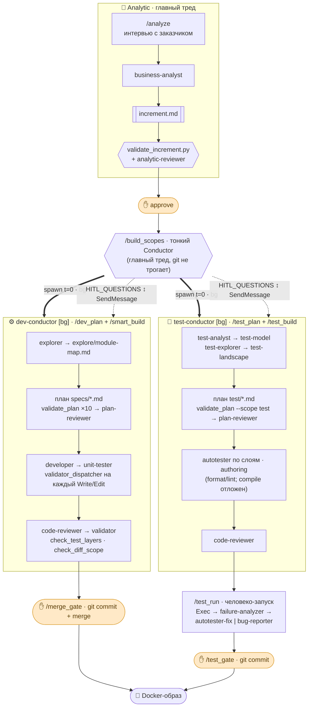

# ms-platform

> **Конвейер разработки на ИИ-агентах.** Превращает задачу, сформулированную словами,
> в протестированный инкремент микросервиса — с аналитикой, кодом, автотестами и
> контролем человека в ключевых точках.

<p align="left">
  
  
  
  
</p>

---

## Зачем это

Один сквозной цикл вместо ручной передачи задачи между аналитиком, разработчиком и
тестировщиком. Заказчик описывает задачу в свободной форме — дальше команда
специализированных ИИ-агентов проводит её через **анализ → разработку → тестирование**,
а человек подтверждает результат на ключевых рубежах.

**На выходе:** готовый к деплою Docker-образ + полный след работы — спецификация
инкремента, код, автотесты и баг-репорты.

---

## Ключевые возможности

- **Параллельные Dev и Test.** Код и автотесты создаются одновременно, от одной спецификации.
- **Человек на ключевых рубежах.** Согласование спецификации, merge кода и приёмка тестов — за человеком; рутину агенты делают сами.
- **Автоматический триаж падений.** Упавший тест классифицируется как дефект теста или дефект сервиса; первый чинится автоматически, второй оформляется как баг-репорт.
- **Многослойное тестирование.** Unit — на стороне разработки; integration / sys / e2e / ui / load — на стороне тестирования.
- **Контроль качества на каждом шаге.** Линтеры, компиляция, статический анализ и семантическое ревью кода и планов встроены в конвейер как блокирующие хуки.

---

## Пайплайн



### 🔎 Analytic — `/analyze` (главный тред)

Оркестратор ведёт интервью с заказчиком; написание делегируется агенту
**`business-analyst`** → `analytic/increment.md` (требования ФТ/НФТ, business-flow,
сценарии, критерии приёмки). Stop-хук **`validate_increment.py`** проверяет структуру,
агент **`analytic-reviewer`** — семантику против исходной задачи (→ `review-report.json`).
Завершается **HITL-approve**. Артефакты: `analytic/original_task.txt`,
`increment.md`, `review-report.json`.

### 🧩 Запуск фаз — `/build_scopes` (тонкий Conductor)

Из `increment.md` главный тред спавнит **два фоновых conductor-агента одновременно
(t = 0)** и больше ничего сам не делает (не планирует, не пишет код, git не трогает):

- **Декаплинг.** `dev-conductor` и `test-conductor` читают **один и тот же**
  `increment.md`, независимы и могут принимать разные технические решения. Связь —
  только на прогоне: `/test_run` гоняет тесты против собранного кода.
- **Bubble-up HITL.** Суб-агенты не вызывают `AskUserQuestion`. Планировщик внутри
  conductor'а отдаёт блок `HITL_QUESTIONS` (пауза) → `/build_scopes` спрашивает
  заказчика → возобновляет conductor через `SendMessage`.
- **Свой ledger.** Каждый conductor отслеживает задачи своих под-агентов по их отчётам;
  общего Task-ledger между фазами нет.

### ⚙️ Dev — `dev-conductor` (внутри: `/dev_plan` + `/smart_build`)

| Шаг | Что происходит |
|---|---|
| **Explore** | `explorer` ×N (параллельно) размечают модули тегами → `explore/module-map.md` |
| **Plan** | план `specs/<kebab>.md` → Stop-хуки `validate_new_file` · `validate_file_contains` · `validate_plan` (10 структурных проверок) → ревью агентом `plan-reviewer` |
| **Build** | роутинг контекста `context_router.py → section_loader.py → refs/*`; `developer` (код) → `unit-tester` (юнит-тесты). На **каждый** `Write/Edit` — PostToolUse `validator_dispatcher.py` (блокирующий) |
| **Verify** | `code-reviewer` (PASS/FAIL) → `check_test_layers.py` → `validator` (запускает unit-раннер + трассировка критериев приёмки) → `check_diff_scope.py` (advisory) |
| **Gate** | `/merge_gate` — HITL → `git commit` + `git merge --no-ff` (**единственная** git-операция Dev) |

Пишет **только продуктовый код + unit-тесты**. Модели: `developer` = sonnet,
`code-reviewer`/`plan-reviewer`/`dev-conductor` = opus, `validator` = sonnet.

### 🧪 Test — `test-conductor` (внутри: `/test_plan` + `/test_build`), параллельно с Dev

| Шаг | Что происходит |
|---|---|
| **Model** | `test-analyst` → `test/test-model.md` (применимые слои, паттерны, инфра, раннеры); `test-explorer` → `test/test-landscape.md` (карта тест-ландшафта) |
| **Plan** | план `test/test-plan.md` (autotest-задачи по слоям) → `validate_plan.py --scope test` → `plan-reviewer` |
| **Build (authoring)** | `autotester` пишет тесты по слоям (integration / sys / e2e / ui / load). Гейт в режиме `--authoring`: формат + статика применяются, **компиляция/покрытие отложены** — ссылки на ещё не собранный код не блокируют. Затем `code-reviewer` |
| **Run + триаж** | `/test_run` — **человеко-запуск после готовности кода**: Exec (раннер слоя) → `failure-analyzer` классифицирует каждое падение: **test-side** → чинит `autotester` + ре-ран; **service-side** → `bug-reporter` пишет `test/bugs/*.md`; **unclear** → баг + эскалация |
| **Gate** | `/test_gate` — HITL → `git commit` (единственная git-операция Test) |

**UNIT — не здесь** (это Dev). Расхождения Dev/Test разрешаются на `/test_run`, а не на этапе планирования.

### 🔒 Хуки и валидаторы качества

Код-гейт `validator_dispatcher.py` (PostToolUse, блокирует на первом провале):

| Файлы | Цепочка |
|---|---|
| `.java` | `spotless` → `maven_compile` (+`pmd` всегда, +`jacoco` для `*Test`/`*IT`) |
| `.py` | `ruff` → `ty` → `bandit` |
| `.ts/.tsx` | `eslint` → `tsc` |
| `pom.xml` | `maven_compile` → `ossindex` |

Форматтеры (`spotless`/`ruff`/`prettier`) сами применяют фикс и перепроверяют — блокируют
только на реальных проблемах. Пост-сборка: `check_test_layers.py` (построенные тесты
соответствуют заявленным слоям) и `check_diff_scope.py` (изменения не выходят за рамки плана).

### 📦 Артефакты

| Путь | Кто создаёт | В git |
|---|---|---|
| `analytic/increment.md`, `review-report.json` | Analytic | gitignored |
| `explore/module-map.md` | `explorer` | gitignored |
| `specs/*.md` | `/dev_plan` | committed |
| продуктовый код + unit-тесты | `developer` / `unit-tester` | committed |
| `test/test-model.md`, `test/test-plan.md` | Test | committed |
| автотесты (`*IT`, `e2e/`, `load/`) | `autotester` | committed |
| `test/bugs/*.md` | `bug-reporter` | committed |

> Контракты фаз целиком — [`.claude/DEV_SCOPE.md`](./.claude/DEV_SCOPE.md) и [`.claude/TEST_SCOPE.md`](./.claude/TEST_SCOPE.md).

---

## Быстрый старт

Из корня целевого микросервиса (Java / Spring Boot 3.x), где установлен `.claude/`:

```bash
./install.sh                       # установка конфигурации и MCP-серверов

claude "/analyze <задача в 1–2 фразы>"   # старт: интервью → спецификация → approve
# затем, в той же сессии:
/build_scopes                      # разработка ∥ тестирование из одной спецификации
```

> `/analyze` ведёт интерактивное интервью — запускайте в интерактивной сессии.
> Подробная настройка — [`docs/install.md`](./docs/install.md);
> MCP-серверы — [`docs/serena.md`](./docs/serena.md);
> living-specs (OpenSpec) — [`docs/openspec.md`](./docs/openspec.md).

---

## Под капотом

`ms-platform` — это **конфигурация [Claude Code](https://claude.com/claude-code)**
(не отдельное приложение): набор агентов, команд, хуков и референсов в `.claude/`.
Стек агентов мультиязычный (Java / TypeScript / Python / Rust); фокус — Java / Spring Boot.

- **Архитектура** — [`ARCHITECTURE_PROPOSAL.md`](./ARCHITECTURE_PROPOSAL.md)
- **Каталог агентов и команд** — [`AGENTS_SPECIFICATION.md`](./AGENTS_SPECIFICATION.md)
- **Компоненты** (роутинг контекста, валидаторы, тест-стратегия) — [`docs/`](./docs)

---

## Лицензия

[Apache License 2.0](./LICENSE). Базовая Claude Code-конфигурация основана на апстриме
[`a-simeshin/claude-code-hooks-mastery`](https://github.com/a-simeshin/claude-code-hooks-mastery)
(форк disler) — см. [`UPSTREAM-README.md`](./UPSTREAM-README.md).
